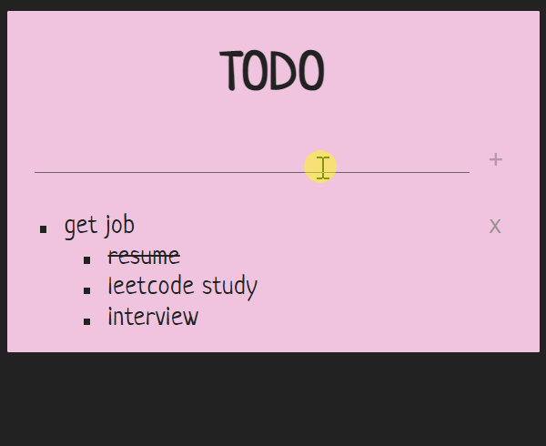
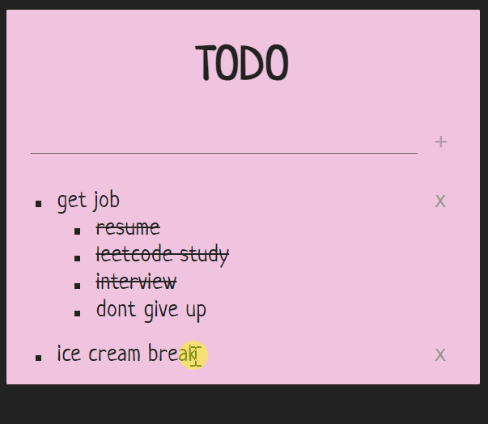

# todolist
WIP 
A web app that mimics a multi-level to-do list sticky note using the MERN stack.

Create Read  

Update Delete  

credits: \
This project is based upon the foundation of https://github.com/Hosni-Abbes 's MERN project.

